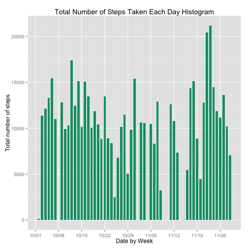
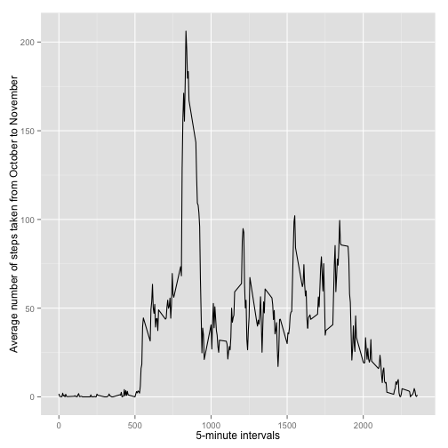
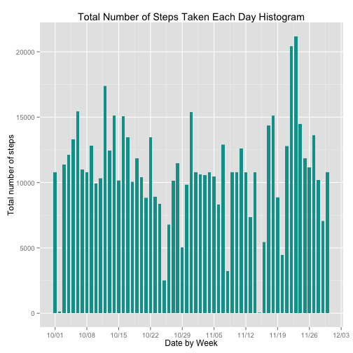
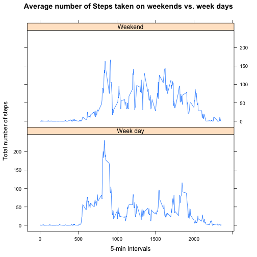

## Default settings

```r
echo = TRUE  # Project Requirement to make code visible
```

## Loading and preprocessing the data and call the required packages for our analysis

```r
require("ggplot2")
require("scales")
require("gridExtra")
require("chron")
require("lattice")
```

##### Confirm if the activity.csv file is in our working directory. If not download and unzip it.

```r
if (!file.exists("activity.zip")){
    unzip ("activity.zip", exdir = "./")
}
```

##### Read the CSV file 

```r
activity_file <- "activity.csv"
data <- read.csv(activity_file, 
           sep = ",", 
           header = TRUE,  
           colClasses = c("integer", "Date", "character"),
           na.strings = "NA")
rm(activity_file) ## some clean-up
   
data_rmNA <- na.omit(data)
```


## What is mean total number of steps taken per day?

1. Make a histogram of the total number of steps taken each day

```r
ggplot(data_rmNA, aes(date, data_rmNA$steps)) + 
  geom_bar(stat = "identity", fill = "#009E73", width = 0.7) +
  scale_x_date(labels = date_format("%m/%d"), breaks = date_breaks("week")) + 
  labs(title = "Total Number of Steps Taken Each Day Histogram", x = "Date by Week", y = "Total number of steps")
```

 

2. Calculate the mean & median

```r
#Sum steps by date
totalSteps <- tapply(data$steps, data$date, FUN=sum, na.rm=TRUE)
```
* Calculate the mean

```r
steps_mean <- mean(totalSteps, na.rm=TRUE)
print(paste0("The mean for the total number steps taken is " , steps_mean))
```

```
## [1] "The mean for the total number steps taken is 9354.22950819672"
```
* Calculate the median

```r
steps_median <-median(totalSteps, na.rm=TRUE)
print(paste0("The median for the total number steps taken is " , steps_median))
```

```
## [1] "The median for the total number steps taken is 10395"
```


## What is the average daily activity pattern?

1. Make a time series plot (i.e. type = "l") of the 5-minute interval (x-axis) and the average number of steps taken, averaged across all days (y-axis)

```r
avgIntervals <- aggregate(x=list(steps=data_rmNA$steps), by=list(interval=as.numeric(data_rmNA$interval)),FUN = mean, na.rm = TRUE)

ggplot(data=avgIntervals, aes(x=interval, y=steps)) +
      geom_line() +
      xlab("5-minute intervals") +
      ylab("Average number of steps taken from October to November")
```

 


2. Which 5-minute interval, on average across all the days in the dataset, contains the maximum number of steps?

```r
mostInterval <- avgIntervals[which.max(avgIntervals$steps), ]
print(mostInterval$interval)
```

```
## [1] 835
```


## Imputing missing values

1. Calculate and report the total number of missing values in the dataset (i.e. the total number of rows with NAs)

```r
# Calculate total number of rows with NA as per the above
sum(is.na(data))
```

```
## [1] 2304
```

2. Devise a strategy for filling in all of the missing values in the dataset. The strategy does not need to be sophisticated. For example, you could use the mean/median 
for that day, or the mean for that 5-minute interval, etc.

> The adopted strategy is to use the mean for each 5min interval to replace the NAs as it makes the most sense.


```r
# Based on our choice, use the mean for each 5-minute interval to replace the NAs
noNA <- data 
for (i in 1:nrow(noNA)) {
    if (is.na(noNA$steps[i])) {
        noNA$steps[i] <- avgIntervals[which(noNA$interval[i] == avgIntervals$interval), ]$steps
    }
}

# Verify there is no NA value
sum(is.na(noNA))
```

```
## [1] 0
```

3. Create a new dataset that is equal to the original dataset but with the missing data filled in.

```r
head(noNA)
```

```
##       steps       date interval
## 1 1.7169811 2012-10-01        0
## 2 0.3396226 2012-10-01        5
## 3 0.1320755 2012-10-01       10
## 4 0.1509434 2012-10-01       15
## 5 0.0754717 2012-10-01       20
## 6 2.0943396 2012-10-01       25
```

```r
#mean(noNA$steps, na.rm=TRUE)

noNA_totalSteps <- tapply(noNA$steps, noNA$date, FUN=sum, na.rm=TRUE)
```

4. Make a histogram of the total number of steps taken each day and Calculate and report the mean and median total number of steps taken per day. Do these values differ from the estimates from the first part of the assignment? What is the impact of imputing missing data on the estimates of the total daily number of steps?

```r
ggplot(noNA, aes(noNA$date, noNA$steps)) + 
  geom_bar(stat = "identity", fill = "#009F99", width = 0.7) +
  scale_x_date(labels = date_format("%m/%d"), breaks = date_breaks("week")) + 
  labs(title = "Total Number of Steps Taken Each Day Histogram", x = "Date by Week", y = "Total number of steps")
```

 

```r
# Calculate new mean
noNA_mean <- mean(noNA_totalSteps)
noNA_mean
```

```
## [1] 10766.19
```

```r
# Compare old mean with the new mean
setNames(data.frame(steps_mean, noNA_mean), c("mean - with NAs","mean with no NAs"))
```

```
##   mean - with NAs mean with no NAs
## 1         9354.23         10766.19
```

```r
         # Calculate new median
noNA_median <- median(noNA_totalSteps)
noNA_median
```

```
## [1] 10766.19
```

```r
# Compare old median with the new median
setNames(data.frame(steps_median, noNA_median), c("median - with NAs","median with no NAs"))
```

```
##   median - with NAs median with no NAs
## 1             10395           10766.19
```
> The mean and median of the new dataframe that omnits the NAs have the same value.


## Are there differences in activity patterns between weekdays and weekends?

1. Create a new factor variable in the dataset with two levels – “weekday” and “weekend” indicating whether a given date is a weekday or weekend day.

```r
noNA$WeekDay <- ifelse(is.weekend(noNA$date) == T,"Weekend", "Week day")
head(noNA)
```

```
##       steps       date interval  WeekDay
## 1 1.7169811 2012-10-01        0 Week day
## 2 0.3396226 2012-10-01        5 Week day
## 3 0.1320755 2012-10-01       10 Week day
## 4 0.1509434 2012-10-01       15 Week day
## 5 0.0754717 2012-10-01       20 Week day
## 6 2.0943396 2012-10-01       25 Week day
```

2. Make a panel plot containing a time series plot (i.e. type = "l") of the 5-minute interval (x-axis) and the average number of steps taken, averaged across all weekday days or weekend days (y-axis). The plot should look something like the following, which was creating using simulated data:

```r
avgWEIntervals <- aggregate(x=list(steps=noNA$steps), by=list(interval=as.numeric(noNA$interval), Weekdays = noNA$WeekDay),FUN = mean, na.rm = TRUE)
# The plot
xyplot(steps ~ interval | factor(Weekdays), data = avgWEIntervals, type = "l", 
       main="Average number of Steps taken on weekends vs. week days", 
       xlab="5-min Intervals",  ylab="Total number of steps",layout=c(1,2))
```

 

